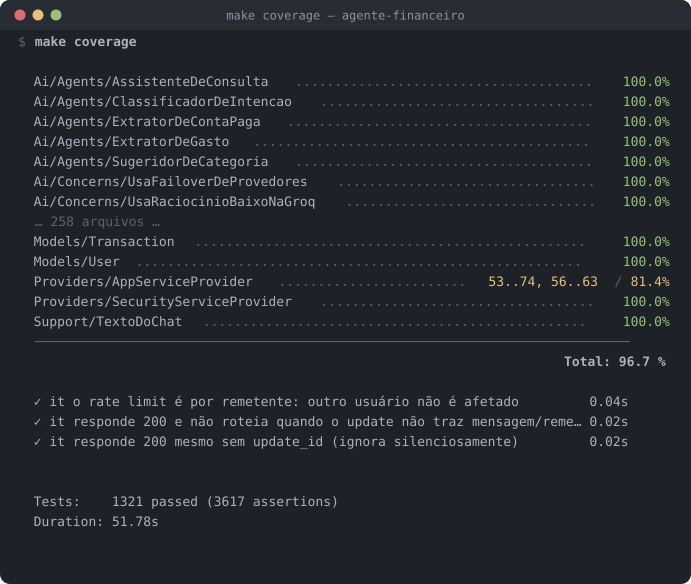

<div align="center">

# 💸 Gestão de Contas com IA

**Controle financeiro pessoal por linguagem natural — no Telegram e na web.**

O coração é um **domínio financeiro determinístico e auditável**. A IA interpreta, classifica e redige —
**nunca calcula dinheiro**.

<br/>

[](https://github.com/lucasmunizb/agente-financeiro/actions/workflows/deploy.yml)
[](docs/COBERTURA.md)
[](docs/COBERTURA.md)


[](LICENSE)

**1321 testes · 3617 asserções · 96,7% de cobertura de linhas** — [output real do Pest](docs/COBERTURA.md),
reproduzível com `make coverage`.


[](https://agentefinanceiro.muniztecnologia.com.br)

**🟢 No ar:** <https://agentefinanceiro.muniztecnologia.com.br>

</div>

---

## 📊 Estado real do projeto

> Esta seção existe para que o README **nunca** divirja do código. Todo número aqui é
> reproduzível com um comando.

| Fato | Valor | Como verificar |
|---|---|---|
| Suíte de testes | **1321 testes · 3617 asserções · verde** | `make test` · [output](docs/COBERTURA.md) |
| Cobertura de linhas | **96,7%** | `make coverage` · [output](docs/COBERTURA.md) |
| Análise estática | **PHPStan level 6** (portão do CI, com baseline de 137 entradas de dívida congelada) + **level 9** em `app/Domain` e `app/Ai` (informativo, sem baseline) | `make stan` · `make stan-domain` |
| Scan de imagem | **Trivy** — HIGH/CRITICAL reprovam o build | `make ci-scan` |
| Deploy | GitHub Actions → Docker Hub → **Docker Swarm** no VPS, atrás de Cloudflare → Nginx | [`.github/workflows/deploy.yml`](.github/workflows/deploy.yml) |
| Ambiente | **Produção ativa**, healthcheck público em `/up` | `curl -I https://agentefinanceiro.muniztecnologia.com.br/up` |

O CI é um **portão real**: `test` (PHPStan + cobertura + suíte) → `build+scan+push` (Trivy) →
`deploy` (Swarm, em fases: migration → espera → app/worker) → `smoke` (healthcheck público).
Se o gate de teste falhar, nada é publicado.

---

## ✨ O que é

Em vez de formulários, você registra gastos conversando — *"paguei 35 conto de uber"* — e consulta
suas finanças por pergunta — *"quanto gastei com comida esse mês?"*. Funciona no **Telegram** e num
**chat na própria web**.

A web e o bot são apenas **canais**. Toda regra de negócio vive no **motor financeiro**: um domínio
determinístico, modelado em **centavos inteiros (BIGINT)**, coberto por testes.

> ### 🧠 Princípio inegociável
> **A IA nunca calcula dinheiro.** Valores, saldos, parcelas, vencimentos e o *"disponível do mês"* são
> calculados de forma determinística (SQL / motor financeiro). A IA só **interpreta, classifica e formata**
> respostas sobre números que o sistema já calculou — e um **guard pós-geração** audita cada número e
> cada data do texto antes do envio.

---

## ✅ O que está no ar

### Domínio financeiro (determinístico, test-first)
- Cartões, contas, formas de pagamento (inclusive **boleto** como forma de 1ª classe), categorias.
- **Parcelamento**, cálculo de **vencimentos** e **fatura do cartão** (derivada das parcelas).
- **Disponível do mês** pela fórmula oficial · **orçamento mensal** · consumo por categoria.
- **Receitas**, **contas em atraso**, **próximas contas**.
- **Recorrência mensal** com geração de ocorrências (`schedule`), previsão no dashboard,
  cancelamento de cobranças futuras preservando o histórico.
- **Quitar conta em qualquer superfície** (extrato, dashboard, bot) — e **reverter** o pagamento.
- **Prevenção de duplicidade** (`DetectorDeDuplicidade` + chave determinística) e **procedência
  auditável**: cada lançamento carrega `origem` (`manual` · `telegram` · `pdf` · `recorrencia`,
  garantida por `CHECK` no banco), e as operações sensíveis (edição, exclusão, reversão de
  pagamento, arquivamento, exportação) gravam `AuditLog`.

### Telegram (bot em produção)
- **Vínculo seguro** por token de uso único, autenticação por `telegram_user_id`, desvínculo pela web.
- Webhook com **segredo verificado (403 sem header)**, **idempotência por `update_id`** e
  **rate limit por remetente**.
- Comandos e intenções: `registrar`, `pagar`, `consultar`, `editar`, `cancelar`, `buscar`, `ajuda`.
- **Confirmação antes de persistir** em todo registro/edição (regra 7 — sem auto-save).
- Bot de **dev separado** do de produção.

### Camada de IA (100% via Laravel AI SDK — `laravel/ai`)
- **5 agentes especializados** em `app/Ai/Agents/`: `ClassificadorDeIntencao`, `ExtratorDeGasto`,
  `ExtratorDeContaPaga`, `SugeridorDeCategoria`, `AssistenteDeConsulta`.
- **4 tools de consulta** com escopo por usuário em `app/Ai/Tools/`: `consultar_gastos`,
  `consultar_disponivel_mes`, `consultar_proximas_contas`, `consultar_fatura_cartao`.
- **Guard pós-geração** ([`GuardPosGeracao`](app/Domain/IA/Guard/GuardPosGeracao.php)):
  extrai **todo** valor monetário e data do texto redigido — formatos formais *e* coloquiais
  (`R$ 1.234,56`, `1500 reais`, `dois reais e cinquenta centavos`, `10/07`,
  `vinte e cinco de dezembro`) — e reprova se algum não existir no payload calculado.
  Divergência ⇒ regenera; esgotou ⇒ fallback **sem números**.
- **Rotação LRU de provedores + cooldown**
  ([`RotacionadorDeProvedores`](app/Domain/IA/Rotacao/RotacionadorDeProvedores.php)): distribui as
  chamadas entre free tiers, bancha quem falha/estoura limite, estado compartilhado entre `app` e
  `worker` sob `Cache::lock`. **Transparente à SDK** — só reordena a lista de `provider()`; o
  **failover** nativo consome a cauda.
- **Resposta com fonte/trace** (barreira 5), **histórico com expurgo de 60 dias**
  (`ai:expurgar-conversas`, agendado) e **log de custo** (`ai_usage_log`, tokens × tabela de preços
  → centavos).
- Testado **offline e determinístico** com os *fakes* da SDK (`Ai::fakeAgent`, `assertAgentWasPrompted`).

### Web
Dashboard, lançamentos (lista, detalhe, edição, cancelamento), gastos, receitas, cartões, orçamento,
categorias, recorrências, fila de confirmações pendentes, chat financeiro, vínculo do Telegram,
configurações, onboarding com consentimento, páginas legais e changelog.

### Segurança e LGPD
- **Nenhum id real em URL** — todo identificador é criptografado (ver seção abaixo).
- **Cabeçalhos de segurança / CSP** sem `unsafe-inline` em `style-src`.
- **Middleware de consentimento LGPD**, **exportação de dados** e **exclusão de conta** com re-auth.
- **Pentest 2026-07** documentado em [`docs/pentest-2026-07-14.md`](docs/pentest-2026-07-14.md):
  **14 de 15 achados corrigidos com testes de regressão**; sem achados Crítico/Alto;
  IDOR/SQLi/mass-assignment/webhook/upload limpos. Resta 1 achado *Low* (enumeração de e-mail no
  registro), que depende de e-mail transacional — ver Roadmap.

---

## 🚧 O que ainda não está pronto

Transparência é parte do projeto. Nada abaixo é vendido como entregue.

| Item | Estado |
|---|---|
| **Importação de fatura em PDF (Itaú)** | **Fora do MVP.** O domínio existe e é testado (`app/Domain/Importacao/`, parser Itaú, OCR Tesseract, detecção de duplicidade, descarte efêmero), mas **não há borda HTTP exposta** — foi promovido à 1ª etapa do pós-MVP. Não use este projeto como prova de "importação de PDF em produção". |
| **Faturas materializadas** (Bloco 9) | Não iniciado. Hoje a fatura é **derivada** das parcelas; não há tabela `invoices`. Bloqueia "quitar a fatura inteira". |
| **Portão final de Segurança/LGPD** (Bloco 8) | Parcial. Pentest aplicado e cabeçalhos/consentimento no ar; faltam os **testes adversariais de prompt** dedicados (injeção/jailbreak/exfiltração) e o hardening do bloco "Segurança" no `instructions()` de todos os agentes. |
| **Golden set do classificador** | Pendente. A fronteira `registrar` × `pagar` ("paguei 40 no mercado" vs "paguei a luz") hoje é separada só pelo prompt — os fakes da SDK não exercitam o modelo real. |
| **Enumeração de conta no registro** (pentest L1) | Deferido. `/criar-conta` revela "e-mail já cadastrado"; mitigado por `throttle:auth`. A correção real exige verificação por e-mail (infra ausente). |
| **Alerta de orçamento por categoria** | Adiado para o pós-MVP. |
| **Limiar de cobertura no CI** | A cobertura roda no CI mas é **informativa** (`continue-on-error`) — ainda sem `--min`. |

---

## 🧱 Stack

| Camada | Tecnologia | Por quê |
|---|---|---|
| **Linguagem / framework** | PHP 8.3 · Laravel 12 | Produtividade, filas, testes, ecossistema maduro |
| **Banco** | PostgreSQL 16 | Precisão financeira, constraints fortes |
| **Dinheiro** | `BIGINT` em centavos | Sem erro de ponto flutuante; formatação pt-BR só na borda |
| **Runtime HTTP** | FrankenPHP | Serve HTTP + PHP em um único processo (web + webhook do Telegram) |
| **Fila** | Driver `database` | Sem Redis no MVP; idempotência por *unique constraint* |
| **IA** | Laravel AI SDK (`laravel/ai ^0.8`) | Agents, Tools, structured output, failover e *fakes* p/ testes |
| **OCR** | Tesseract (no worker) | Embutido na imagem; usado pelo domínio de importação (pós-MVP) |
| **Testes** | Pest 3 / PHPUnit 11 | TDD obrigatório (test-first) |
| **Estática** | PHPStan / Larastan 3 | Level 6 como portão; level 9 no núcleo |
| **Contêineres** | Docker Compose (3 serviços) | `app` · `worker` · `postgres` |
| **Produção** | Docker Swarm + Docker Secrets | Sem `.env`; segredos em `/run/secrets` |

**Fuso base:** `America/Sao_Paulo`.

---

## 🚀 Início rápido

> **Pré-requisito único no host:** Docker + `make`. **Nada mais** é instalado localmente — `php`,
> `composer`, `artisan`, `node` e os testes rodam todos dentro do contêiner.

```bash
# 1. Primeira instalação: sobe os 3 serviços, instala deps, gera APP_KEY e migra.
make bootstrap

# 2. Confirme que está tudo no ar
make ps

# 3. Rode a suíte de testes
make test
```

Pronto. A aplicação responde em **http://localhost:8000** (health check em `/up`).

No dia a dia:

```bash
make up      # sobe os contêineres
make down    # derruba (mantém o volume do Postgres)
make logs    # acompanha os logs
```

---

## 🧪 Como testar (TDD)

O projeto é **test-first**: para cada feature, escreve-se o teste que **falha** antes da implementação.

```bash
make test                                    # a suíte inteira (1321 testes)
make pest                                    # roda o Pest diretamente
make coverage                                # cobertura via PCOV → build/coverage/clover.xml
make stan                                    # PHPStan level 6 (portão do CI)
make stan-domain                             # PHPStan level 9 no núcleo (app/Domain + app/Ai)
make stan-debt                               # a dívida sem baseline (o termômetro)
make artisan c="test --filter=Disponivel"    # um teste específico
```

Output real do `make coverage` (recorte fiel — a evidência completa e o que os 3,3% descobertos
representam estão em [`docs/COBERTURA.md`](docs/COBERTURA.md)):



Exemplo do estilo de teste do domínio financeiro (Pest):

```php
it('calcula o disponível do mês pela fórmula oficial', function () {
    // Receitas 5.000,00 − cartão vencendo no mês 1.200,00 − PIX do mês 300,00
    $disponivel = app(DisponivelDoMes::class)->para($user, '2026-06');

    expect($disponivel->cents())->toBe(350000); // R$ 3.500,00
});
```

> A camada de IA é testada com os **fakes da Laravel AI SDK** — determinístico, sem chamar provedor real.

---

## 🔁 Validar o pipeline localmente (antes do `git push`)

O deploy é automatizado por GitHub Actions (`.github/workflows/deploy.yml`):
**`test` (gate TDD) → `build+scan+push` (Trivy) → `deploy` (Swarm) → `smoke`**. Para não
descobrir falha só depois do push, dá para **reproduzir localmente os estágios que não
tocam produção**:

```bash
make ci-local      # pipeline inteiro sem produção: stan + coverage + test + build + scan
make ci-test       # só o gate de teste
make ci-build      # só o build do target de produção
make ci-scan       # só o scan Trivy (HIGH/CRITICAL) da última imagem
```

**Por que não basta `make test`:** o `ci-*` roda contra uma **exportação limpa do git**
(`git archive`), igual ao `actions/checkout` do runner — **sem** `public/build`, `vendor`
nem `node_modules` (todos gitignored). Isso reproduz bugs que só aparecem no checkout
limpo (ex.: *"Vite manifest not found"*), que um `make test` na sua árvore de trabalho
mascararia. Inclui suas mudanças **em arquivos rastreados** ainda não commitadas; ignora
o que o git ignora.

> `deploy` e `smoke` tocam a produção e **não** rodam localmente — são promovidos só por
> você via `git push` (regra inviolável 1). Detalhes em [`scripts/ci-local.sh`](scripts/ci-local.sh).

---

## 🛠️ Comandos úteis (Makefile)

Todos os alvos encapsulam `docker compose` — nenhum comando roda no host.

| Comando | O que faz |
|---|---|
| `make help` | Lista todos os alvos disponíveis |
| `make bootstrap` | Primeira instalação (esqueleto + up + migrate) |
| `make up` / `make down` | Sobe / derruba os contêineres |
| `make stop` / `make restart` | Para / reinicia sem remover |
| `make build` / `make rebuild` | Builda a imagem (com / sem cache) |
| `make ps` | Status dos contêineres |
| `make logs` · `make logs-app` · `make logs-worker` | Logs (segue) |
| `make shell` · `make worker-shell` | Bash nos contêineres |
| `make test` · `make pest` | Roda a suíte de testes |
| `make coverage` | Cobertura (PCOV) → `build/coverage/clover.xml` |
| `make stan` · `make stan-domain` · `make stan-debt` | Análise estática |
| `make ci-local` | Reproduz o pipeline (stan + coverage + test + build + scan) |
| `make ci-test` · `make ci-build` · `make ci-scan` | Estágios individuais do CI local |
| `make migrate` · `make fresh` · `make seed` | Migrations / recriar do zero / seeds |
| `make key` · `make tinker` | Gera `APP_KEY` / abre o Tinker |
| `make artisan c="..."` · `make composer c="..."` | Comandos arbitrários |

---

## 🐳 Arquitetura de contêineres

```
┌─────────────────────────────────────────────────────────────┐
│  DEV — docker-compose.yml (3 contêineres)                    │
│                                                              │
│   app        FrankenPHP · HTTP (web + webhook Telegram)      │
│   worker     queue:work + schedule:work · Tesseract (OCR)    │
│   postgres   banco + backend da fila (driver database)       │
└─────────────────────────────────────────────────────────────┘
                              │  escala sem reescrita (por env/perfil)
                              ▼
   Redis + Horizon · réplicas do app · bot dedicado · Prometheus/Grafana
                              │
                              ▼
┌─────────────────────────────────────────────────────────────┐
│  PRODUÇÃO — docker-stack.yml (Docker Swarm)                  │
│  SEM .env · segredos em /run/secrets (Docker Secrets)        │
│  Cloudflare ─TLS→ Nginx (VPS) ─proxy_pass→ stack             │
└─────────────────────────────────────────────────────────────┘
```

**Configuração & segredos:**
- **Dev:** `.env` (não versionado) + `.env.example`.
- **Produção:** sem `.env`. Chaves (DB, IA, Telegram, `APP_KEY`) vêm de **Docker Secrets**, lidas pelo
  *entrypoint* via padrão `*_FILE` apontando para `/run/secrets/<nome>`.
- **Edge:** exemplo de Nginx em [`docs/deploy/nginx-agentefinanceiro.conf.example`](docs/deploy/nginx-agentefinanceiro.conf.example).

---

## 📂 Estrutura do projeto

```
.
├── app/
│   ├── Ai/{Agents,Tools,Concerns}   # camada Laravel AI SDK (5 agents · 4 tools)
│   ├── Domain/                      # motor financeiro determinístico
│   │   ├── IA/{Guard,Rotacao,...}   # guard pós-geração · rotação LRU de provedores
│   │   ├── Telegram/                # vínculo, roteamento, confirmação
│   │   └── Recorrencia/ Parcelamento/ Disponivel/ Dashboard/ ...
│   ├── Http/                        # controllers, middleware (CSP, LGPD, webhook)
│   └── Jobs/ Console/Commands/      # fila e agendados
├── tests/                           # 167 arquivos · 1321 testes (Pest)
├── docker/
│   ├── Dockerfile         # imagem app+worker (FrankenPHP + Tesseract), rootless
│   ├── Caddyfile          # config do servidor HTTP
│   └── entrypoint.sh      # resolve segredos *_FILE antes do boot
├── docker-compose.yml     # dev: app, worker, postgres
├── docker-stack.yml       # prod: Swarm + Docker Secrets
├── .github/workflows/     # deploy.yml: test → build+scan → deploy → smoke
├── Makefile               # alvos finos que encapsulam o Docker
├── docs/                  # escopo destrinchado (00 → 11, specs, ROADMAP, TODO, pentest)
├── CLAUDE.md              # regras invioláveis + fluxo de trabalho
└── .claude/skills/        # skills do projeto (backend, dba, devops, deploy, segurança, LGPD, frontend)
```

---

## 📚 Documentação

Comece por [`docs/00-visao-geral.md`](docs/00-visao-geral.md). O desenvolvimento é **orientado a spec**:
cada bloco tem um spec autocontido em [`docs/specs/`](docs/specs/README.md).

| Doc | Conteúdo |
|---|---|
| [`01-decisoes-estruturais`](docs/01-decisoes-estruturais.md) | Stack e fundações |
| [`02-governanca-ia`](docs/02-governanca-ia.md) | Determinismo e as 5 barreiras anti-alucinação |
| [`03-regras-financeiras`](docs/03-regras-financeiras.md) | Parcelas, vencimentos, disponível do mês |
| [`04-modelo-dados`](docs/04-modelo-dados.md) · [`05-arquitetura`](docs/05-arquitetura.md) | Entidades, serviços e fluxos |
| [`06-telegram`](docs/06-telegram.md) · [`07-importacao-pdf`](docs/07-importacao-pdf.md) · [`08-categorias`](docs/08-categorias.md) | Canais e pipelines |
| [`09-nfr-seguranca-lgpd`](docs/09-nfr-seguranca-lgpd.md) · [`10-estrategia-testes`](docs/10-estrategia-testes.md) · [`11-devops`](docs/11-devops.md) | NFRs, testes, infra |
| [`pentest-2026-07-14`](docs/pentest-2026-07-14.md) | Relatório de pentest e correções aplicadas |
| [`COBERTURA`](docs/COBERTURA.md) | Evidência dos badges: output real do Pest e como reproduzir |
| [`ROADMAP-MVP`](docs/ROADMAP-MVP.md) · [`ROADMAP-POS-MVP`](docs/ROADMAP-POS-MVP.md) · [`TODO`](docs/TODO.md) | Fases e checklist por bloco |

---

## 🗺️ Roadmap

O roadmap é organizado em **Blocos** (ver [`docs/TODO.md`](docs/TODO.md), a fonte de verdade).

| Bloco | Entrega | Status |
|---|---|---|
| **0** | Bootstrap DevOps (compose, esqueleto, fila, Makefile) | ✅ **Pronto** |
| **1** | Domínio financeiro (parcelas, vencimentos, disponível, duplicidade) | ✅ **Pronto** |
| **2** | Cadastro manual de gastos e receitas (status, origem, auditoria, edição, cancelamento) | ✅ **Pronto** |
| **3** | Telegram: vínculo, autenticação, webhook idempotente, roteamento | ✅ **Pronto** |
| **4** | IA de interpretação: agentes de intenção/extração, structured output, confirmação, `ai_usage_log`, failover | ✅ **Pronto** |
| **4c** | Rotação LRU de provedores + cooldown | ✅ **Pronto** |
| **5** | Chat financeiro: 4 tools com escopo por usuário + **guard pós-geração** + trace | ✅ **Pronto** |
| **6 / 6b** | Dashboard (agregações do mês) e contas em atraso | ✅ **Pronto** |
| **10 / 12** | Recorrência mensal, ocorrências, previsão e cancelamento | ✅ **Pronto** |
| **13** | Quitar conta em qualquer superfície (extrato, dashboard, bot) + reversão | ✅ **Pronto** (falta o golden set do classificador) |
| **FE** | Frontend web (Blade + Tailwind v4) — etapa separada do backend | ✅ **Pronto** para as features acima |
| **8** | Segurança e LGPD — portão de fechamento | 🟡 **Parcial** (pentest aplicado, CSP e consentimento no ar; faltam testes adversariais de prompt e hardening dos `instructions()`) |
| **9** | Faturas materializadas (tabela `invoices`, pagamento da fatura) | ⬜ **Não iniciado** (decisões de modelagem em aberto) |
| **Pós-MVP 1** | Importação de fatura em PDF (Itaú) — domínio e testes prontos, **sem borda exposta** | 🟠 **Dormant** (fora do MVP) |
| **Pós-MVP** | WhatsApp · áudio · imagem de comprovante · multiusuário · metas · exportação · conciliação | ⬜ |

> **Frontend é sempre etapa separada** — mensagens do bot e telas web nunca são construídas junto com a
> feature de backend correspondente.

---

## 🔒 Identificadores nas URLs

**Regra inegociável: nenhum id real de recurso aparece em claro numa URL.** Todo
identificador que sairia num parâmetro — seja no _path_ de uma rota
(`/lancamentos/{id}`), seja num valor de filtro na _query string_
(`?categoria={id}`) — é **sempre criptografado** com a `APP_KEY` e só existe em claro
dentro do servidor.

**Como funciona**

- [`App\Domain\Shared\OpaqueId`](app/Domain/Shared/OpaqueId.php) — value object que
  `encode(int)` → token opaco e `decode(string)` → id (ou `null`). Usa `Crypt`
  (AES keyed pela `APP_KEY`), com **IV aleatório** (o mesmo id gera tokens diferentes
  a cada render — não dá para enumerar/correlacionar recursos pela URL) e saída
  **base64 URL-safe** (`[A-Za-z0-9_-]`, sem `+ / =`). Sem TTL: o link continua válido.
- [`App\Models\Concerns\HasOpaqueRouteId`](app/Models/Concerns/HasOpaqueRouteId.php) —
  aplicado a `Transaction`, `Category`, `Card`. Sobrescreve `getRouteKey()` (então
  `route('...', $model)` já emite o token) e expõe `opaqueId()` para usos fora de rota.
- **Decodificação na borda:** o parâmetro de rota `{transaction}` é resolvido por
  `Route::bind` (em [`AppServiceProvider`](app/Providers/AppServiceProvider.php)) — token
  inválido **ou id em claro** ⇒ **404**. Os filtros da query são decodificados no
  controller; id em claro é simplesmente ignorado. O **escopo por usuário** continua no
  controller/domínio (`findOrFail` por `user_id`).

> Consequência de segurança: rotas enumeráveis (`/lancamentos/123`) deixam de
> existir — só o token abre a tela. Sempre gere links passando o **model**
> (`route('lancamentos.show', $tx)`) ou `OpaqueId::encode($id)`; **nunca** o id cru.

**O que NÃO é criptografado** (não são ids de recurso): período (`?mes=YYYY-MM`), busca
livre (`?busca=`), forma/status (enums) e a afordância de revisão `?estado=`.

---

## 📐 Regras invioláveis

1. **Nunca `git push`** sem ordem explícita (commits locais apenas).
2. **Test-first (TDD)** — testes que falham antes de qualquer código de feature.
3. **Frontend é etapa separada** do backend.
4. **A IA nunca calcula dinheiro** (cálculo determinístico + guard pós-geração).
5. **Dinheiro em centavos inteiros**; fuso `America/Sao_Paulo`.
6. **PDF/texto de fatura nunca são persistidos** (processamento efêmero, sem dados sensíveis).
7. **Confirmação antes de persistir** em todo registro/edição no MVP.
8. **Toda IA via Laravel AI SDK** (`laravel/ai`).
9. **Tudo roda em contêiner** — nada no host além de Docker + `make`.
10. **Produção = Docker Swarm + Docker Secrets**, sem `.env`.

Detalhes completos em [`CLAUDE.md`](CLAUDE.md).

---

## 📄 Licença

Distribuído sob a **[Licença MIT](LICENSE)** — uso, cópia, modificação e redistribuição livres,
mantendo o aviso de copyright. © 2026 Lucas Muniz.

---

<div align="center">
<sub>Projeto pessoal · backend-first · TDD · IA determinística por design.</sub>
</div>
